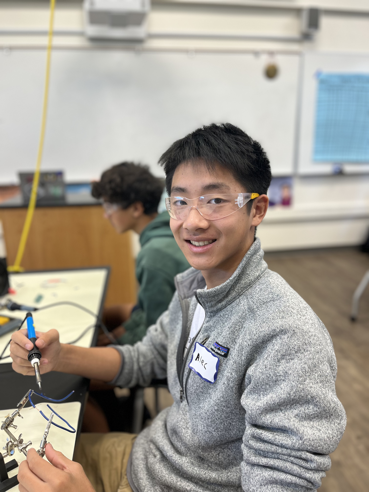

# coreXY 3d printer
A coreXY 3d printer involves a gantry where the x and y axes move, and a vertical z axis. This configuration of 3d printer is superior to traditional "bed slinger" printers where the y and z axes are attatched to each other, inducing stress on the system as the z axis has to lift the heavy toolead. A coreXY alleviates this issue by moving z axis independently from the x and y, allowing for longer printer lifespan and faster prints.


| **Engineer** | **School** | **Area of Interest** | **Grade** |
|:--:|:--:|:--:|:--:|
| Alec G | Saratoga High School | Mechanical Engineering | incoming junior

<!---  -->


# Third Milestone 

<iframe width="560" height="315" src="https://www.youtube.com/embed/mP-Wq3X1T_g" title="YouTube video player" frameborder="0" allow="accelerometer; autoplay; clipboard-write; encrypted-media; gyroscope; picture-in-picture; web-share" allowfullscreen></iframe>


My third milestone involved installing firmware on my 3d printer and getting it to print a "benchy" (a benchmark test in the shape of a boat for 3d printers). 

This milestone was by far the most challenging, but I also learned the most from it. Throughout the process of achieving an acceptable print, I short circuited and fried a motherboard, caused a small explosion, and had to rewire my entire printer several times. 

I began the process by using Raspberry Imager to setup a Mainsail/Klipper profile on a raspberry pi 4. I then used SSH to access my raspberry pi console (running on Debian Linux), where I was able to flash Klipper on my SKR Pico motherboard. I had some issues with SSH, being unable to connect to it on my laptop. However, after reconfiguring my computer's IP v6 compatabiliy, I was able to access my raspberry pi and Mainsail interface.

After wiring everything together, I attempted to "home" my 3d printer using sensorless homing. However, I ran into the issue that my printer was unable to detect when the stepper motors were experiencing a stall, and therefore, the sensorless homing would fail every time. I tried to fix this issue by jumping the pins for the x and y endstops (which I did not have), but that caused a short circuit and fried my motherboard.

I replaced the SKR Pico with an SKR Mini V3, and redid the entire process of flashing Klipper and using SSH to create the configuration files for my printer. However, because I still had not jumped the x and y axes endstop pins, sensorless homing still did not work. The SKR Mini V3 has diagnostic pins for the x and y endstops, and after jumping those pins, sensorless homing started working. I was able to begin my first print, but the printer was underextruding, resulting in nothing coming out the nozzle. After a bit of troubleshooting with the extruder, I found that loosening a screw on the Sherpa Mini extruder fixed the extrusion issue. 

However, my initial benchy prints either failed or completely ripped off the bed. The Klippy log files displayed an error of m2 and m3 arcs not being recognized, so after a bit of research I configured my printer to recognize m2 and m3 arcs. After this, my prints looked much cleaner and I was able to print a benchy that surpassed the quality of ender 3 printers, and approaching the quality of high-end printers such as Prusas and Bambulabs.

## SKR Mini V3 Config files

I found a repository for semi-configured printer config files on Github, and used the template for the SKR Mini v3 as the basis for my custom config file. 
 
### printer.cfg
```
# This file contains common pin mappings for the BIGTREETECH SKR mini
# E3 v3.0. To use this config, the firmware should be compiled for the
# STM32G0B1 with a "8KiB bootloader" and USB communication/USART.

# The "make flash" command does not work on the SKR mini E3. Instead,
# after running "make", copy the generated "out/klipper.bin" file to a
# file named "firmware.bin" on an SD card and then restart the SKR
# mini E3 with that SD card.

# See docs/Config_Reference.md for a description of parameters.
[include mainsail.cfg]
[include sensorless.cfg]
[virtual_sdcard]
path: ~/printer_data/gcodes
on_error_gcode: CANCEL_PRINT

[force_move]
enable_force_move: true

#[include KlipperScreen.conf]

#[include timelapse.cfg]

[exclude_object]


[pause_resume]

[mcu]
serial: /dev/serial/by-id/usb-Klipper_stm32g0b1xx_410005001250415833323520-if00

[gcode_arcs]
#resolution: 1.0
#   An arc will be split into segments. Each segment's length will
#   equal the resolution in mm set above. Lower values will produce a
#   finer arc, but also more work for your machine. Arcs smaller than
#   the configured value will become straight lines. The default is
#   1mm.

[printer]
kinematics: corexy
max_velocity: 300
max_accel: 10000
max_z_velocity: 300
max_z_accel: 100

#[safe_z_home]
#home_xy_position: 115,115 # Change coordinates to the center of your print bed
#speed: 50
#z_hop: 10                 # Move up 10mm
#z_hop_speed: 5


# A Stepper connected to XM
[stepper_x]
step_pin: PB13 # checked
dir_pin: PB12  # checked
enable_pin: !PB14 # checked
microsteps: 32 # checked
rotation_distance: 40 # checked
endstop_pin: tmc2209_stepper_x:virtual_endstop
homing_retract_dist: 0
position_endstop: 110
position_max: 110
homing_speed: 50

[tmc2209 stepper_x]
diag_pin: ^PC0 # use the same pin that was previously the endstop_pin!
driver_SGTHRS: 135
uart_pin: PC11 # checked
tx_pin: PC10
uart_address: 0
run_current: 0.75
sense_resistor: 0.110
stealthchop_threshold: 1


# B Stepper connected to YM
[stepper_y]
step_pin: PB10 # checked
dir_pin: PB2 # checked
enable_pin: !PB11 # checked
microsteps: 32 # checked
rotation_distance: 40 # checked
endstop_pin: tmc2209_stepper_y:virtual_endstop
homing_retract_dist: 0
position_endstop: 109
position_max: 109
homing_speed: 50

[tmc2209 stepper_y]
diag_pin: ^PC1 # use the same pin that was previously the endstop_pin!
driver_SGTHRS: 100
uart_pin: PC11
tx_pin: PC10
uart_address: 2
run_current: 0.75
sense_resistor: 0.110
stealthchop_threshold: 1

[stepper_z] #Connected to ZAM
step_pin: PB0
dir_pin: !PC5
enable_pin: !PB1
microsteps: 16
rotation_distance: 40
# endstop_pin: ^PC2
position_endstop: 100
endstop_pin: PC2
position_max: 100
position_min: -1.5

[tmc2209 stepper_z]
uart_pin: PC11
tx_pin: PC10
uart_address: 1
run_current: 0.580
hold_current: 0.500
stealthchop_threshold: 1

[extruder] # connected to EM
step_pin: PB3
dir_pin: !PB4
enable_pin: !PD1
microsteps: 16
rotation_distance: 3.7710
nozzle_diameter: 0.400
filament_diameter: 1.750
heater_pin: PC8
sensor_type: Generic 3950
sensor_pin: PA0
#control: pid
#pid_Kp: 21.527
#pid_Ki: 1.063
#pid_Kd: 108.982
min_temp: 0
max_temp: 250

[tmc2209 extruder]
uart_pin: PC11 
tx_pin: PC10
uart_address: 3
run_current: 0.75
#hold_current: 0.500
stealthchop_threshold: 0

[heater_bed]
heater_pin: PC9 #checked
sensor_type: ATC Semitec 104GT-2 #checked
sensor_pin: PC4 #checked
#control: pid
#pid_Kp: 54.027
#pid_Ki: 0.770
#pid_Kd: 948.182
min_temp: 0
max_temp: 130

[temperature_fan controller_fan] # electronics fan connected to FAN2
pin: PB15
#heater: heater_bed
#heater_temp: 45.0
sensor_type: temperature_host
control: watermark
min_temp: 0
max_temp: 100
target_temp: 30

[heater_fan nozzle_cooling_fan]
pin: PC6

[fan]
pin: PC7


## CB1 Temp
[temperature_sensor RPi]
sensor_type: temperature_host
min_temp: 10
max_temp: 100

## MCU Temp
[temperature_sensor MCU_temp]
sensor_type: temperature_mcu
min_temp: 0
max_temp: 100

#[mcu rpi]
#serial: /tmp/klipper_host_mcu

#[adxl345]
#cs_pin: rpi:None

#[resonance_tester]
#accel_chip: adxl345
#probe_points:
 #   55, 55, 20  # an example

[board_pins]
aliases:
    # EXP1 header
    EXP1_1=PB5,  EXP1_3=PA9,   EXP1_5=PA10, EXP1_7=PB8, EXP1_9=<GND>,
    EXP1_2=PA15, EXP1_4=<RST>, EXP1_6=PB9,  EXP1_8=PD6, EXP1_10=<5V>


######################################################################
#  BigTreeTech TFT TouchScreen emulated 12864 mode
######################################################################

[display]
lcd_type: emulated_st7920
spi_software_miso_pin: PD8 # status led, Virtual MISO
spi_software_mosi_pin: PD6
spi_software_sclk_pin: PB9
en_pin: PB8
encoder_pins: ^PA10, ^PA9
click_pin: ^!PA15

[output_pin beeper]
pin: PB5

[homing_override]
axes: xyz
gcode:
  

  
    _HOME_X
  

 
    _HOME_Y
  
  
  
    FORCE_MOVE STEPPER=stepper_z DISTANCE=-8 VELOCITY=25
    G28 Z
    G90 
    G1 X54 Y54 Z25
  


[bed_screws]
screw1: 54,5
screw1_name: front screw
screw2: 0,108
screw2_name: back left
screw3: 108,108
screw3_name: back right

[gcode_macro PRINT_START]
#   Use PRINT_START for the slicer starting script - please customize for your slicer of choice
gcode:
    G28                            ; home all axes
    G90                            ; absolute positioning    
    #G1 Z-20 F3000                   ; move nozzle away from bed
   
[gcode_macro PRINT_END]
#   Use PRINT_END for the slicer ending script - please customize for your slicer of choice
gcode:
    M400                           ; wait for buffer to clear
    G92 E0                         ; zero the extruder
    G1 E-4.0 F3600                 ; retract filament
    G91                            ; relative positioning

    #   Get Boundaries
    
    
    

    #   Check end position to determine safe direction to move
    
        
    
        
    

    
        
    
        
    

    
        
    
        
    

    G0 Z{z_safe} F3600             ; move nozzle up
    G0 X{x_safe} Y{y_safe} F20000  ; move nozzle to remove stringing
    TURN_OFF_HEATERS
    M107                           ; turn off fan
    G90                            ; absolute positioning
    G0 X54 Y{max_y} F3600          ; park nozzle at rear
  
[gcode_macro LOAD_FILAMENT]
gcode:
   M83                            ; set extruder to relative
   G1 E30 F300                    ; load
   G1 E15 F150                    ; prime nozzle with filament
   M82                            ; set extruder to absolute
    
[gcode_macro UNLOAD_FILAMENT]
gcode:
   M83                            ; set extruder to relative
   G1 E10 F300                    ; extrude a little to soften tip
   G1 E-40 F1800                  ; retract some, but not too much or it will jam
   M82                            ; set extruder to absolute

#*# <---------------------- SAVE_CONFIG ---------------------->
#*# DO NOT EDIT THIS BLOCK OR BELOW. The contents are auto-generated.
#*#
#*# [heater_bed]
#*# control = pid
#*# pid_kp = 69.398
#*# pid_ki = 0.993
#*# pid_kd = 1212.736
#*#
#*# [extruder]
#*# control = pid
#*# pid_kp = 18.137
#*# pid_ki = 1.656
#*# pid_kd = 49.651
#*#
#*# [input_shaper]
#*# shaper_type_x = mzv
#*# shaper_freq_x = 73.0
#*# shaper_type_y = mzv
#*# shaper_freq_y = 71.2
```

### sensorless homing
```
[gcode_macro _HOME_X]
gcode:
    # Always use consistent run_current on A/B steppers during sensorless homing
    
    
    
    SET_TMC_CURRENT STEPPER=stepper_x CURRENT={HOME_CURRENT}
    SET_TMC_CURRENT STEPPER=stepper_y CURRENT={HOME_CURRENT}

    # Home
    G28 X
    # Move away
    G91
    G1 X-10 F4000
    
    # Wait just a second… (give StallGuard registers time to clear)
    G4 P1000
    # Set current during print
    SET_TMC_CURRENT STEPPER=stepper_x CURRENT={RUN_CURRENT_X}
    SET_TMC_CURRENT STEPPER=stepper_y CURRENT={RUN_CURRENT_Y}

[gcode_macro _HOME_Y]
gcode:
    # Set current for sensorless homing
    
    
    
    SET_TMC_CURRENT STEPPER=stepper_x CURRENT={HOME_CURRENT}
    SET_TMC_CURRENT STEPPER=stepper_y CURRENT={HOME_CURRENT}

    # Home
    G28 Y
    # Move away
    G91
    G1 Y-10 F4000

    # Wait just a second… (give StallGuard registers time to clear)
    G4 P1000
    # Set current during print
    SET_TMC_CURRENT STEPPER=stepper_x CURRENT={RUN_CURRENT_X}
    SET_TMC_CURRENT STEPPER=stepper_y CURRENT={RUN_CURRENT_Y}
```


# Second Milestone

<iframe width="560" height="315" src="https://www.youtube.com/embed/O88H9iitzWI" title="YouTube video player" frameborder="0" allow="accelerometer; autoplay; clipboard-write; encrypted-media; gyroscope; picture-in-picture; web-share" allowfullscreen></iframe>

My second milestone involved the assembly and wiring of my printer. This task involved redesigning and printing several components, and the usage of several materials such as PLA and PETG.
### Upper Frame
I began with the assembly of the upper frame and gantry of my printer, which involved using 3x4x5 heat inserts to make threaded holes in my plastic parts. These heat inserts allowed me to screw on 200mm MGN9C linear rails with 4 m3x16 screws for the X axis as well as the motor and ilder mounts (using m3x8). The idler bearings were screwed on with m5x25 screws, and the motors with m3x8 screws. 
### Heatbed Assembly
The bed required a few tries to get right because of some spacing issues with the 8mm linear bearings, and an issue with Z-Axis belting. For bed leveling, I installed 3 thumb screws and 3 springs on m3x50 screws, and attatched the heat bed on top of them. 
### Y axis
For the Y axis, I attatched the 150mm MGN9C rail to the left and right carriages with m3x8 screws.
### Linear Rod Installation
I then attatched the 200x8mm linear rods to both the top and bottom frames, using heat inserts and m3x6 screws a set screws to hold them in. Anticipating damage to the rods because of the set screws, I covered the ends of the linear rods with painter's tape. 
### Bottom Frame
Assembling the bottom frame also took several iterations. The first iteration lacked set screws, so the linear rods would often detatch. The second iteration had an unforseen issue of motherboard mounting, and the third iteration fixed all of these issues. I then mounted the SKR Pico motherboard using m3x4x4 heat inserts, the Z axis endstop switch with m2 screws, and the Z motor with m3x8 screws. The feet were mounted with m5x20 screws.
### Toolhead
I used a soldering iron to heat press m3 nuts into the toolhead (which was printed in PETG for better heat resistance), and screwed in the CR-10 Hotend. The 2 part cooling fans were installed on the side using m2.5 screws, and the central hotened fan was installed by heat inserting screws into small holes. 
### Extruder
My printer uses a sherpa mini extruder in a direct-drive configuration to move filament, but when I 3d printed the parts I found that the tolerances were way too off for the extruder to be effective. I instead used a CNCed aluminum version, which worked much better.
### Wiring
Wiring was an issue, as I did not have access to JST wire extendors. Therefore, I cut the existing wires and soldered more wire onto them, extending my wires to the necessary lengths. I had to do this for all 3 of the fan wires, and the thermistor wire for my heatbed. I also had to cut and rearrange the wires for my stepper motors, as I discovered that the configuration they were in was not compatible with the SKR Pico motherboard. 

## Challenges
During the assembly of the printer I encountered many issues regarding spacing. These issues caused me to have to reprint many large parts after changing something very small, resulting in a large amount of wasted filament. 
#### Heatbed
Like the toolhead, the heatbed was printed out of PETG material instead of PLA, due to its ability to withstand high temperatures. During assembly, I realized that there was too much tolerance on the bearing holes, causing the bed to slip on and off of the bearings. I solved this issue by drilling 4mm holes into the walls, and using 3x4x5 heat inserts and m3 screws as set screws to hold the printed part in place. 
#### Wiring
When testing, I noticed that all of my stepper motors were vibrating, instead of revolving. Initially believing this to be a software issue, I spent many hours on the printer.config file trying to debug the issue. However, I realized that the color ordering of the 4 pin connectors were inconsistent, leading me to the conclusion that the motors were not functioning due to this inconsistency. After cutting the wires and resoldering them together in different configurations, the motors moved in the correct directions.

# First Milestone
<iframe width="560" height="315" src="https://www.youtube.com/embed/mP-Wq3X1T_g" title="YouTube video player" frameborder="0" allow="accelerometer; autoplay; clipboard-write; encrypted-media; gyroscope; picture-in-picture; web-share" allowfullscreen></iframe>

My project is a mostly 3d printed CoreXY 3d printer, and for my first milestone I CADed all the necessary parts. After taking some inspiration from Rolohaun3D's "Rook" CoreXY printer, I used Onshape, a browser-based CAD software to model 3 nema 17 stepper motor mounts, 2 carriages, 2 idlers, the upper and lower frames, build plate/bed support, and mounts for the motherboard and power supply.

## Challenges
While CADing, I ran into the issue of part dimensions, and the issue of spacing. I was able to find an open source library of common 3d printer parts on the internet, and imported them into my Onshape document. I then used the assembly feature to make sure that all the parts I modeled would fit together. 

In addition, I printed out a couple of parts for testing, and though I did try to compensate for prints shrinking, there was still a significant amount of shrinking that made some parts unsuitable for use. Before reprinting, I made sure that the new parts had more tolerance.

# Starter Project

<iframe width="560" height="315" src="https://www.youtube.com/embed/ft7FQacSrX8" title="YouTube video player" frameborder="0" allow="accelerometer; autoplay; clipboard-write; encrypted-media; gyroscope; picture-in-picture; web-share" allowfullscreen></iframe>

## Description:

My starter project used the Arduino starter kit, and is a small trashcan whose lid opens when a ultrasonic sensor detects an object within 10 cm of it. When it triggers, a servo turns to the 90 degree position, functioning as the lid. The servo will remain in the 90 degree position until the object is no longer within a certain threshold. I used Onshape to model a box and a lid, and printed them out. I also routed most of the wiring inside the box for aesthetic purposes. For the circuit itself, I created a prototype on a breadboard, and after testing my code on it, I transferred the wiring to a protoshield. 

## Software:
My project was programmed in the Arduino IDE, and involves a while loop that runs if there is an object within the distance threshold, checking every 100 milliseconds. If the while loop triggers, it triggers the servo to move to the 90 degree position, and then refreshes its value for the distance to the object. Once the loop stops running, the servo is programmed to return to the neutral position.

## Challenges:
I experienced some trouble while using the Arduino IDE. As I am familiar with other programming languages such as java and python, I assumed that the "output" window on the IDE was its console, so when I was looking for the values my code was supposed to be outputting, I couldnt find anything on the output. I thought that it was a software issue, so I spent a long time searching for a bug. However, I eventually discovered the "Serial Console", which was where my values were being output.
# Code

```c++
#include <Servo.h>

#define echoPin 12
#define trigPin 11
// choose pin for the buzzer
int servoPin = 9;      // Servo Pin
int distanceThreshold = 10;

Servo Servo1;             // creating servo object

void setup() {
  Serial.begin (9600);
  pinMode(trigPin, OUTPUT); // Set trigPin as OUTPUT
  pinMode(echoPin, INPUT);  // Set echoPin as INPUT
  Servo1.attach(servoPin);  // attaching servo pin
}

void loop() {
  long duration, distance;
  
  // Send a pulse to trigPin
  digitalWrite(trigPin, LOW); 
  delayMicroseconds(2); 
  digitalWrite(trigPin, HIGH);
  delayMicroseconds(10); 
  digitalWrite(trigPin, LOW);
  
  duration = pulseIn(echoPin, HIGH);
  distance = (duration / 2) / 29.1;

  Serial.print(distance);
  Serial.print(" ");

  while (distance < distanceThreshold){
    Servo1.write(90);
 
    Serial.print("something happened! ");
    digitalWrite(trigPin, LOW); 
    delayMicroseconds(2); 
    digitalWrite(trigPin, HIGH);
    delayMicroseconds(10); 
    digitalWrite(trigPin, LOW);
    duration = pulseIn(echoPin, HIGH);
    distance = (duration / 2) / 29.1;
    delay(500);
  }

    Servo1.write(0);

  delay(1000);
}
```

# Bill of Materials

| **Part** | **Note** | **Price** | **Link** |
|:--:|:--:|:--:|:--:|
| 6mm GT2 Belt | x y and z axes movement| $12 | <a href="https://www.amazon.com/Upgrade-Non-Slip-Version-Printer-Printers/dp/B08R93QQ8Z/ref=sr_1_5?sr=8-5"> Link </a> |
| 20 tooth pulleys (3x) | Driving belts | $9 | <a href="https://www.amazon.com/3Dman-Pulley-Timing-Aluminum-Printer/dp/B085XLRXS1/ref=sr_1_4?sr=8-4"> Link </a> |
| F695 Bearings (18x) | idlers for belts | $10 | <a href="https://www.amazon.com/F695-2RS-Bearing-5x13x4mm-Miniature-Bearings/dp/B07VMJLXLH/ref=sr_1_2?sr=8-2"> Link </a> |
| Assorted screws (m3, m4, m5) | Structure | $25 | <a href="https://www.amazon.com/Machine-Assortment-Metric-Washers-Button/dp/B0C3926M1B/ref=sr_1_1_sspa?sr=8-1-spons&sp_csd=d2lkZ2V0TmFtZT1zcF9hdGY&psc=1"> Link </a> |
| Bed leveling springs | bed leveling | $Price | <a href="https://www.amazon.com/Springs-Upgrade-Printer-Leveling-Heatbed/dp/B0CHWJKQVG/ref=sr_1_1_sspa?sr=8-1-spons&sp_csd=d2lkZ2V0TmFtZT1zcF9hdGY&psc=1"> Link </a> |
| Omron switch | z axis limit switch | $7 | <a href="https://www.amazon.com/Cylewet-25Pcs-Switch-Arduino-CYT1073/dp/B073TYWX86/ref=sr_1_14?sr=8-14"> Link </a> |
| 120mmx120mm heated bed| build surface | $Price | <a href="https://www.amazon.com/Arduino-A000066-ARDUINO-UNO-R3/dp/B008GRTSV6/"> Link </a> |
| Nema 17 42mm stepper motors (3x)| driving x y and z axes | $13*3 | <a href="https://www.amazon.com/Stepper-Motor-Bipolar-64oz-Printer/dp/B00PNEQI7W/ref=sr_1_5?sr=8-5"> Link </a> |
| pancake stepper motor | driving sherpa mini extruder kit | $19 | <a href="https://www.amazon.com/Extruder-Compatible-Stealthburner-Directly-Printer/dp/B0BFGPR4V1/ref=sr_1_1_sspa?sr=8-1-spons&sp_csd=d2lkZ2V0TmFtZT1zcF9hdGY&psc=1"> Link </a> |
| Aluminum Sherpa Mini extruder | driving filament | $60 | <a href="https://www.amazon.com/FYSETC-Sherpa-Extruder-Compatible-Printer/dp/B095WFBGL4/ref=sxin_16_pa_sp_search_thematic_sspa?cv_ct_cx=sherpa+mini&pd_rd_i=B095WFBGL4&sbo=RZvfv%2F%2FHxDF%2BO5021pAnSA%3D%3D&sr=1-1-6024b2a3-78e4-4fed-8fed-e1613be3bcce-spons&sp_csd=d2lkZ2V0TmFtZT1zcF9zZWFyY2hfdGhlbWF0aWM&psc=1"> Link </a> |
| CR-10 Hotend | nozzle and hotend for filament | $13 | <a href="https://www.amazon.com/CHPOWER-Assembly-Replacement-CR-10S400-CR-10S500-12V/dp/B07B6HSYR8/ref=sxin_16_pa_sp_search_thematic_sspa?cv_ct_cx=cr10+hotend&pd_rd_i=B07B6HSYR8&s=industrial&sbo=RZvfv%2F%2FHxDF%2BO5021pAnSA%3D%3D&sr=1-2-6024b2a3-78e4-4fed-8fed-e1613be3bcce-spons&sp_csd=d2lkZ2V0TmFtZT1zcF9zZWFyY2hfdGhlbWF0aWM&psc=1"> Link </a> |
| PTFE tubing | bowden extruder and feeding filament | $7 | <a href="https://www.amazon.com/Meters-White-Teflon-Bowden-Filament/dp/B01CUPV9KC/ref=sr_1_1_sspa?s=industrial&sr=1-1-spons&sp_csd=d2lkZ2V0TmFtZT1zcF9hdGY&psc=1"> Link </a> |
| 200mm MGN9C linear rails (2x) | X axis | $18*2 | <a href="https://www.amazon.com/Linear-Sliding-Carriage-Printer-Machine/dp/B0BZGVZB6T/ref=sr_1_3_sspa?s=industrial&sr=1-3-spons&sp_csd=d2lkZ2V0TmFtZT1zcF9hdGY&psc=1"> Link </a> |
| 150mm MGN9c linear rail | Y axis | $18 | <a href="https://www.amazon.com/s?k=150mm+mgn9c&i=industrial"> Link </a> |
| LM8UU linear bearings (2x) | holding z-axis  | $18 | <a href="https://www.amazon.com/uxcell-LM8UU-Linear-Bearings-Length/dp/B07H93T58J/ref=sr_1_5?s=industrial&sr=1-5"> Link </a> |
| 200x8mm linear rods | z axis structure  | $16 | <a href="https://www.amazon.com/Hardened-Chrome-Plated-Linear-Printer/dp/B09YRLS34X/ref=sr_1_3?s=industrial&sr=1-3"> Link </a> |
| SKR Mini v3 | MCU motherboard | $43 | <a href="https://www.amazon.com/BIGTREETECH-Control-TMC2209-Stepper-Upgrade/dp/B09LC34SCK/ref=sr_1_1?s=industrial&sr=1-1"> Link </a> |
| Raspberry pi 4 | secondary MCU and to run klipper  | $60 | <a href="https://www.amazon.com/Raspberry-Model-2019-Quad-Bluetooth/dp/B07TC2BK1X/ref=sr_1_4?sr=8-4"> Link </a> |
| 4010 blower fan (2x) | part cooling  | $11 | <a href="https://www.amazon.com/WINSINN-Blower-Upgrade-Bearing-CR-10S/dp/B08R9J189W/ref=sr_1_4?sr=8-4"> Link </a> |
| 3010 fan | hotend cooling  | $10 | <a href="https://www.amazon.com/WINSINN-Brushless-Cooling-30x30x10mm-Extruder/dp/B0757N6B8P/ref=sr_1_5?sr=8-5"> Link </a> |
| 120mm PEI build plate | build surface  | $10 | <a href="https://www.amazon.com/120x120mm-Textured-Magnetic-Adhesive-Printer/dp/B09TXM7VFC/ref=sr_1_2?sr=8-2"> Link </a> |
| 1 kg 1.75mm PLA filament | frame parts  | $18 | <a href="https://www.amazon.com/OVERTURE-Filament-Consumables-Dimensional-Accuracy/dp/B07PGZNM34/ref=sr_1_5_pp?sr=8-5"> Link </a> |
| 1 kg 1.75mm PETG filament | bed support and toolhead  | $21 | <a href="https://www.amazon.com/OVERTURE-Filament-Consumables-Dimensional-Accuracy/dp/B07PDV9RC8/ref=sr_1_5_pp?sr=8-5"> Link </a> |


